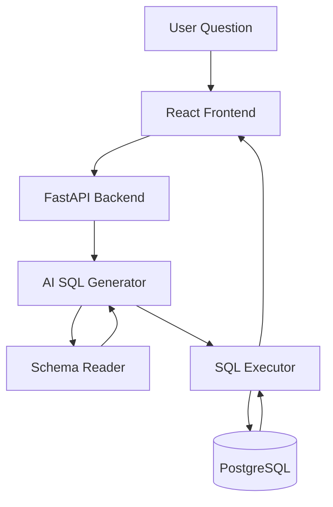
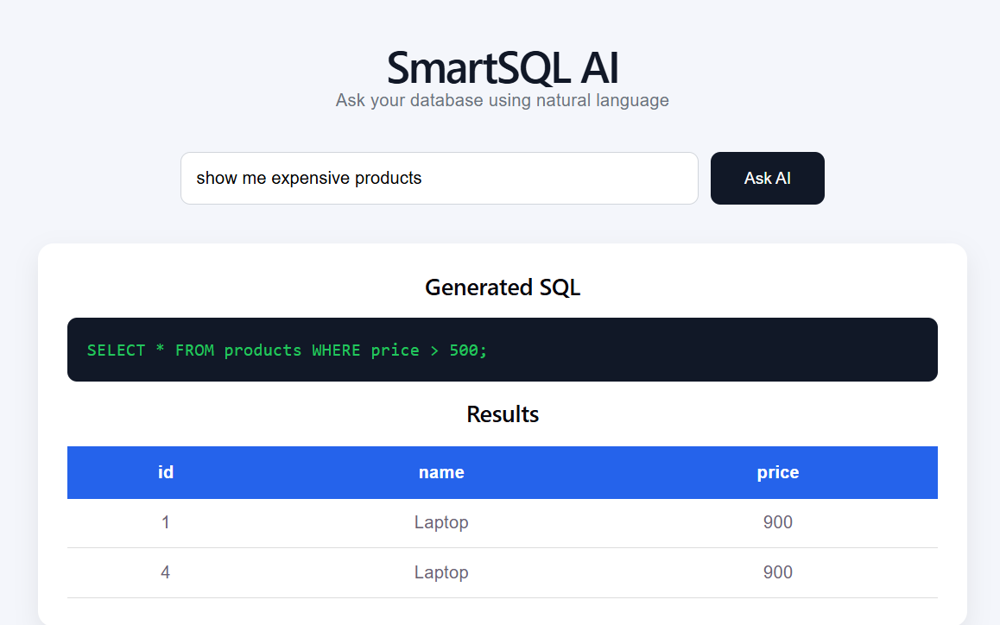

# 🚀 SmartSQL AI

<p align="center">

### AI-Powered Natural Language to SQL Assistant

Convert natural language into SQL queries using AI, execute them securely on PostgreSQL databases, and display structured results through a modern web interface.

</p>

---

## 📸 Project Preview

> Add your screenshots here

<p align="center">


</p>

---

# ✨ Features

- 🤖 Natural Language → SQL Generation
- 🧠 Schema-Aware AI Query Generation
- ⚡ FastAPI REST API
- 🗄 PostgreSQL Integration
- 🔐 Secure SQL Execution
- 📊 Structured Query Results
- 💻 Modern React Interface
- 🔄 Local SQL Generator Fallback

---

# 🏗 Architecture



---

# 🛠 Tech Stack

| Category | Technology |
|-----------|------------|
| Language | Python |
| Backend | FastAPI |
| Database | PostgreSQL |
| ORM | SQLAlchemy |
| Frontend | React |
| Build Tool | Vite |
| AI | OpenAI GPT |
| API | REST API |

---

# 📂 Project Structure

```
SmartSQL-AI
│
├── backend
│   ├── app
│   │   ├── ai
│   │   │   ├── sql_generator.py
│   │   │   ├── local_sql_generator.py
│   │   │   ├── sql_executor.py
│   │   │   └── schema_reader.py
│   │   │
│   │   ├── routers
│   │   ├── database.py
│   │   ├── models.py
│   │   └── main.py
│   │
│   └── requirements.txt
│
├── frontend
│   ├── src
│   ├── public
│   └── package.json
│
├── docs
│   ├── home.png
│   ├── query.png
│   └── result.png
│
└── README.md
```

---

# ⚙ Getting Started

## Clone Repository

```bash
git clone https://github.com/AliAbuSalah1/SmartSQL-AI.git

cd SmartSQL-AI
```

---

## Backend

```bash
cd backend

python -m venv venv

# Windows
venv\Scripts\activate

pip install -r requirements.txt
```

Create `.env`

```env
DATABASE_URL=your_database_url

OPENAI_API_KEY=your_api_key
```

Run

```bash
python -m app.create_tables

uvicorn app.main:app --reload
```

Backend

```
http://127.0.0.1:8000
```

Swagger

```
http://127.0.0.1:8000/docs
```

---

## Frontend

```bash
cd frontend

npm install

npm run dev
```

Runs at

```
http://localhost:5173
```

---

# 💡 Example

### User Question

```
Show me expensive products
```

Generated SQL

```sql
SELECT *
FROM products
WHERE price > 500;
```

Output

| id | Product | Price |
|----|----------|------|
|1|Laptop|900|

---

# 📸 Screenshots

## Home



---

## Generated SQL


---

## Results


---

# 🔒 Security

- SQL Validation
- Read-Only Query Support
- Schema-Aware Generation
- Local SQL Generator Fallback

---

# 🚀 Future Improvements

- User Authentication
- Query History
- SQL Injection Protection
- Database Visualization
- Multi-Database Support
- Docker Deployment
- Cloud Deployment
- Role-Based Access Control

---

# 👨‍💻 Author

**Ali Abu Salah**

GitHub

https://github.com/AliAbuSalah1

LinkedIn

https://linkedin.com/in/ali-ai-ds

---

⭐ If you like this project, don't forget to leave a Star!
